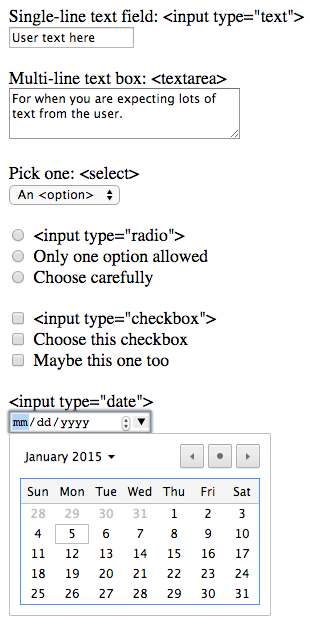

# HTML Forms: Basics

## `form` and `submit`

Forms are a major part of most applications. Your user's deepest
interactions with your application are through forms.

An HTML form allows a user to fill out fields. Common form elements
include:

* Single-line text fields (`text`)
* Multi-line text boxes (`textarea`)
* Drop-down select boxes (`select` and `option`)
* Radio buttons (`radio`)
* Check boxes (`checkbox`)
* Date selectors (`date`)



A form's input tags are wrapped in a `form` tag. The form should present
a button (an `input` tag with `type=submit`). When the user clicks the
`submit` button, the browser will package up the input data, put it in
the body of a request, and send it to the server:

```html
<form action="http://99cats.com/cats" method="post">
  <!-- input elements -->

  <input type="submit" value="Create cat">
</form>
```

The `form` tag's `action` attribute contains the URL to which the form
data should be sent, the `method` attribute describes the HTTP method
that should be used. A typical form will POST the data; GET forms are
typically only used for search forms, which will merely request data
to be fetched.

## `text` input type

The most common type of input is a single-line text field. A `text`
input tag presents a single line of text input for the user to submit:

```html
<form action="http://99cats.com/cats" method="post">
  <input type="text" name="cat[first_name]">
  <input type="text" name="cat[last_name]">

  <input type="submit" value="Create cat">
</form>
```

## HTML's `form` and Rails' `params`

When you submit a form to the server, Rails will take the form data and
make them available to your controller through the `params` hash.

The form's input names will be the keys in the hash, while the values
will be the values of the form. So if your form looks like this:

```html
<form action="http://99cats.com/cats" method="post">
  <input type="text" name="first_name">
  <input type="text" name="last_name">

  <input type="submit" value="Create cat">
</form>
```

The browser will post something like:

```
POST /cats
Host: 99cats.com

first_name:Kiki
last_name:Beck
```

Rails will parse the request body and produce a `params` hash like
this: `{ "first_name" => "Kiki", "last_name" => "Beck" }`.

Most of your forms create model objects; you want to build these with
mass-assignment:

```ruby
class CatsController < ApplicationController
  def create
    Cat.create!(cat_params)

    # redirect to cats index
    redirect_to cats_url
  end

  private

  def cat_params
    params.require(:cat).permit(:first_name, :last_name)
  end
end
```

This won't work yet: there is no value `"cat"` in the params hash. All
the cat data is in the "top level". To fix this, we rename the form
inputs:

```html
<form action="http://99cats.com/cats" method="post">
  <input type="text" name="cat[first_name]">
  <input type="text" name="cat[last_name]">

  <input type="submit" value="Create cat">
</form>
```

These new names don't mean anything to the browser; they don't change
the HTTP POST request except for the names of the uploaded values. So
we'll post something like this:

```
POST /cats
Host: 99cats.com

cat%5Bfirst_name%5D:Kiki
cat%5Blast_name%5D:Beck
```

Note that `%5B` and `%5D` are the URL encodings for `[` and `]`.

The difference comes when Rails translates the form data to the
`params` hash. As a convention, it will see the square brackets for
`cat[first_name]` and nest the `first_name` attribute inside an inner
`cat` hash: `{ "cat" => { "first_name" => "Kiki", "last_name" =>
"Beck" } }`.

This will make the previous `CatsController#create` code work.

### Why do we nest object parameters?

One last thought. Why can't we just write:

```ruby
class CatsController < ApplicationController
  def create
    Cat.create!(cat_params)

    # redirect to cats index
    redirect_to cats_url
  end

  private

  def cat_params
    # seems easier to just call .permit on params
    # why have a nested hash under :cat at all?
    params.permit(:first_name, :last_name)
  end
end
```

The reason is that `params` contains not just the form data, but also
other, Rails-generated params. Specifically, params always contains the
keys `:controller` and `:action`. These are very uncommon to use, but
nesting the `Cat` attributes under the `:cat` key cleanly separates the
Cat-specific params from any other params.

## `textarea` tag

The `textarea` tag is a kind of input tag. It renders a multi-line
text box:

```html
<form action="http://99cats.com/cats" method="post">
  <label for="cat_biography">Cat's Life Story</label>
  <textarea name="cat[biography]" id="cat_biography"></textarea>

  <input type="submit" value="Create cat">
</form>
```

Use `<input type=text>` for fields like usernames; use `<textarea>`
for free text of variable length like blog posts.

## `select` tag

A `select` tag presents a drop-down of options to the user.

```html
<form action="http://99cats.com/cats" method="post">
  <label for="cat_coat_color">Coat color</label>
  <!-- dropdown -->
  <select name="cat[coat_color]" id="cat_coat_color">
    <!-- `brown`, if selected, is the value that will be submitted to
         the server; user is displayed "Brown" as the choice -->
    <option value="brown">Brown</option>
    <option value="black">Black</option>
    <option value="blue">Blue</option>
  </select>
  <br>

  <input type="submit" value="Create cat">
</form>
```

Notice how the options are nested inside the `select` tag; each
`option` tag is one option in the dropdown. The options have a `value`
attribute (which is what is actually sent to the server), as well as a
body, which is what is presented to the user.

## `label` tag

Input elements should be labeled so the user knows what they are:
```html
<form action="http://99cats.com/cats" method="post">
  <label for="cat_first_name">First name</label>
  <input type="text" name="cat[first_name]" id="cat_first_name">
  <label for="cat_last_name">Last name</label>
  <input type="text" name="cat[last_name]" id="cat_last_name">

  <input type="submit" value="Create cat">
</form>
```

The `for` attribute of the `label` tag is supposed to match the `id`
of the `input` tag. Note that square brackets are not allowed in the
`id`, which is why it differs from `name`. The convention is to turn
the leading `[` to an underscore.

One benefit of using `for`/`id` is that clicking the `label` element
will move the cursor into the associated input tag.

## `hidden`

Sometimes you want data to be sent to the server, but do not want the
user to select it. This is the purpose of the `hidden` tag.

```erb
<form action="http://99cats.com/cats" method="post">
  <input type="hidden" name="redirect_to" value="<%= request.original_url %>">

  <!-- ... -->

  <input type="submit" value="Create cat">
</form>
```

Here this form specifies that after processing the form the controller
should redirect back to the current url (`request.original_url`). Let's
see how we could implement this behavior in our controller:

```ruby
class CatsController < ApplicationController
  def create
    cat = Cat.create!(cat_params)

    redirect_to params[:redirect_to] || cat_url(cat)
  end

  private

  def cat_params
    params.require(:cat).permit(:first_name, :last_name, :biography, :coat_color)
  end
end
```

We want to send the URL up as part of the form so it can be used, but
it is not actually something we want the user to input
themselves. That's the prototypical case for `hidden`.

Note that if the user opens up Chrome's HTML inspector, they can
change the value of the hidden field. `hidden` inputs are **not
secure** because they are editable.

## `radio` input type

Like a `select` tag, the `radio` input type lets you choose one option
of many. Every radio button for a group has the same name (here,
`cat[sex]`); each one will have a different `value`. The chosen radio
button's `value` will be uploaded on form submission. If no button is
chosen, then nothing for that key is uploaded.

Note that we can individually label the radio buttons, even though
they all have the same `name` attribute, because the `id` should still
be unique (`cat_sex_male`, `cat_sex_female`):

```html
<form action="http://99cats.com/cats" method="post">
  <input type="radio" name="cat[sex]" id="cat_sex_female" value="f">
  <label for="cat_sex_female">Female</label>
  <br>

  <input type="radio" name="cat[sex]" id="cat_sex_male" value="m">
  <label for="cat_sex_male">Male</label>

  <input type="submit" value="Create cat">
</form>
```

## `checkbox`

If you want to allow the user to select multiple options, you may want
a `checkbox`:

```html
<form action="http://99cats.com/cats" method="post">
  <input type="checkbox" name="cat[colors][]" id="cat_color_black" value="black">
  <label for="cat_color_black">Black</label>
  <br>

  <input type="checkbox" name="cat[colors][]" id="cat_color_red" value="red">
  <label for="cat_color_red">Red</label>
  <br>

  <input type="checkbox" name="cat[colors][]" id="cat_color_white" value="white">
  <label for="cat_color_white">White</label>
  <br>

  <input type="submit" value="Create cat">
</form>
```

This form will allow users to select multiple check-boxes. Each ticked
box will have its value uploaded to the server. For instance, say I
check black and white:

```
POST /cats
Host: 99cats.com

cat%5Bcolor%5D%5B%5D:black
cat%5Bcolor%5D%5B%5D:white
```

When Rails sees the `[]` at the end of the parameter name, it will
know that an array of values is being uploaded. It will collect up all
the values for the `cat[colors]` key and put them in an array. Thus:

```ruby
params == { cat: { colors: ['black', 'white'] } }
```

## References

* [Understanding Parameter Naming Conventions][understanding-parameter-naming-conventions]

[understanding-parameter-naming-conventions]: http://guides.rubyonrails.org/form_helpers.html#understanding-parameter-naming-conventions
